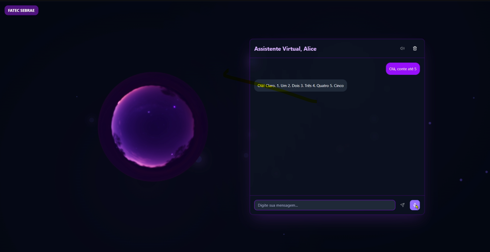

<div align="center">
  <h1>Assistente Virtual com IA</h1>
</div>


## 🎬 Demonstração

 


## 📖 Sobre o Projeto

Este repositório contém um **protótipo de assistente virtual** com interface de chatbot futurista, **suporte a voz** (base implementada) e **renderização 3D**. Ele combina um **frontend moderno** (Next.js + Tailwind + shadcn/ui + React Three Fiber) com um **backend em Python (FastAPI)** que orquestra chamadas à **API Google Generative AI (Gemini)**.

O objetivo é oferecer uma experiência **imersiva e intuitiva**, com:
- Conversas em **texto** (pronto) e **voz** (fundação implementada, expansível);
- **Assistente 3D** sutil e responsivo;
- **Partículas/efeitos** para reforçar a estética futurista.

---

## ✨ Funcionalidades

- **UI Interativa e Responsiva** — Next.js + Tailwind + shadcn/ui.
- **Assistente 3D** — esfera animada em **React Three Fiber**, reagindo sutilmente à interação.
- **Multimodal (base)** — texto pronto; **captura de áudio** preparada para evolução.
- **Respostas de IA** — backend integra-se ao **Google Gemini** para gerar respostas coesas.
- **APIs limpas** — endpoints REST com **FastAPI** e **Uvicorn** para execução local.
- **Pronta para Deploy** — separação clara de frontend e backend facilita hospedagem independente.

---

## 🧱 Arquitetura & Estrutura de Pastas

> Estrutura recomendada (ajuste se seu projeto já possuir uma organização diferente).

```
assistente-virtual/
├── frontend/                 # Next.js (UI)
│   ├── public/
│   ├── src/
│   │   ├── app/             # Rotas e layout (Next.js App Router)
│   │   ├── components/      # Componentes UI
│   │   ├── lib/             # Helpers (requisições, schemas, etc.)
│   │   └── styles/
│   ├── .env.local.example
│   └── package.json
├── backend/                  # FastAPI (serviços)
│   ├── app.py                # Ou main.py (módulo FastAPI `app`)
│   ├── routers/              # (opcional) separação por domínios
│   ├── services/             # integrações (ex.: gemini.py)
│   ├── models/               # pydantic models
│   ├── requirements.txt
│   └── .env.example
├── assets/                   # GIFs, vídeos e imagens do README/site
│   ├── demo.gif
│   └── demo.mp4
└── README.md
```


---

## ⚙️ Configuração de Ambiente

Crie arquivos `.env` para **frontend** e **backend** (valores de exemplo abaixo).

### Frontend (`frontend/.env.local`)
```env
# URL pública do backend
NEXT_PUBLIC_BACKEND_URL=http://localhost:8000

# (opcional) nome “carinhoso” do assistente apresentado na UI
NEXT_PUBLIC_ASSISTANT_NAME=Orion
```

### Backend (`backend/.env`)
```env
# Chave do Google — gere no Google AI Studio
GOOGLE_API_KEY=COLOQUE_SUA_CHAVE_AQUI

# Modelo padrão (ajuste conforme sua implementação)
MODEL=gemini-1.5-pro

# CORS — ajuste se publicar o frontend em outro host
ALLOWED_ORIGINS=http://localhost:3000
```

> **Dica:** mantenha seus arquivos `.env` fora do versionamento (`.gitignore`).

---

## 🚀 Como Executar


```

### 2) Backend (FastAPI)
```bash
cd backend

# Ambiente virtual
python -m venv venv

# Ativar (Windows PowerShell)
.\venv\Scripts\Activate.ps1
# Ativar (Windows cmd)
.\venv\Scripts\activate.bat
# Ativar (Linux/macOS)
source venv/bin/activate

# Dependências
pip install -r requirements.txt

# Variáveis de ambiente
cp .env.example .env   # (ou crie manualmente e cole sua GOOGLE_API_KEY)

# Subir servidor (ajuste o módulo conforme seu arquivo principal)
uvicorn app:app --reload --port 8000
# ou, se seu arquivo for main.py com objeto 'app':
# uvicorn main:app --reload --port 8000
```

### 3) Frontend (Next.js)
Abra um **novo terminal** na raiz do projeto:
```bash
cd frontend

# Dependências
npm install
# ou
yarn
# ou
pnpm install

# Variáveis de ambiente
cp .env.local.example .env.local

# Subir a aplicação
npm run dev
# Default: http://localhost:3000
```

> Certifique-se de que `NEXT_PUBLIC_BACKEND_URL` (frontend) aponta para a porta/host do backend.

---


## 🧪 Teste Rápido da API

Com o backend rodando, você pode testar rapidamente via `curl` (ajuste rotas/payload conforme sua implementação):
```bash
# Exemplo: rota /chat (POST) enviando uma mensagem do usuário
curl -X POST http://localhost:8000/chat \
  -H "Content-Type: application/json" \
  -d '{"message":"Olá, quem é você?"}'
```

> Se você utiliza um prefixo (ex.: `/api`), lembre-se de ajustar a **rota** no frontend.


---

## 📄 Licença

Este projeto está sob a licença **MIT**. Veja o arquivo `LICENSE` para mais detalhes.
](https://github.com/telesvfx/chatbot-portugues---Copia/tree/main)